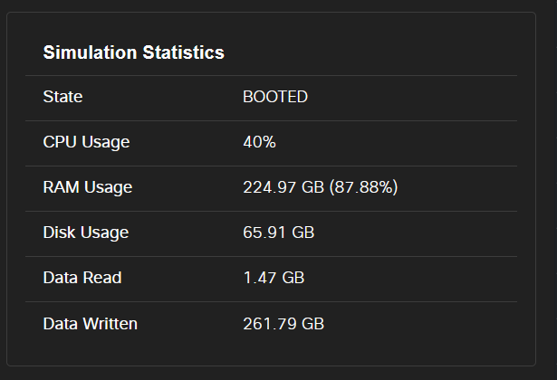

# Cisco Catalyst Center

This directory contains a node definition for Cisco Catalyst Center (formerly Cisco DNA Center).

This is a _very large_ node definition, requiring 32 vCPUs and 256 GB of RAM.  There is no option for a
smaller deployment at this time.  Once booted, this consumes up to 3 TB of disk space:



### Image Availability

You must have an account on Cisco.com that is entitled to download Catalyst Center from
[Software Center](https://software.cisco.com/download/home/286316341/type/286318832/release/2.3.7.10-VA).  Currently,
only 2.3.7.10 has been tested to work.

There is no specific
QCOW2 for ISE, however.  You can convert the OVA's three VMDK files to QCOW2 using the `qemu-img` command:

```sh
qemu-img convert -f vmdk -O qcow2 disk1.vmdk disk1.qcow2
qemu-img convert -f vmdk -O qcow2 disk2.vmdk disk2.qcow2
qemu-img convert -f vmdk -O qcow2 disk3.vmdk disk3.qcow2
```

You must create the image definition by hand to ensure the three disks are properly referenced.  You can use
this [image definition](../../../virl-base-images/cisco/catalyst-center/catalyst-center-2.3.7.10.yaml) as a guide.
