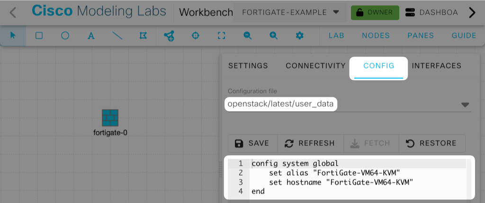

# Fortinet FortiGate Node Definitions

This directory contains a node definition for the Fortinet FortiGate appliance.

### Image Availability

Images can be downloaded from https://support.fortinet.com/ with a proper account and entitlement.

### Default definition

By default, a user named “admin” exists.

|Name|Value|
|-----|-----|
|Username|`admin`|
|Password|(None)|
|CPU|1|
|Memory|2GB|
|Data Disk Size|32GB|
|Interface|4|
|Serial Port|1|

The following is an example of the first login for version 7.6.6.

```sh
FortiGate-VM64-KVM login: admin
Password: (ENTER)
Verifying password...

You are forced to change your password. Please input a new password.
According to the password policy enforced on this device, please change your password!
New password must conform to the following policy:
minimum-length=12 upper-case-letter=1 lower-case-letter=1 number=1 non-alphanumeric=1

New Password: 
Confirm Password: 
Verifying password...
Welcome!

FortiGate-VM64-KVM # 
```

### Configuration Example

This node definition supports initial configuration via Cloud-Init. Set the initial configuration to “`openstack/latest/user_data`”.



To add an additional “cisco” user, configure it as follows. This has been verified to work on FortiGate 7.0 to 7.6.

```
config system global
    set alias "FortiGate-VM64-KVM"
    set hostname "FortiGate-VM64-KVM"
end
config system interface
    edit "port1"
        set mode dhcp
        set allowaccess ping https ssh http
    next
end
config system password-policy
    set status disable
end
config system admin
    edit "cisco"
        set accprofile "super_admin"
        set password "cisco"
    next
end
```
